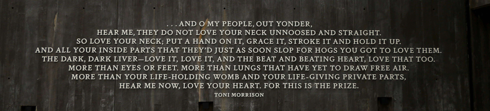

### 

::: {#talks-listing}
:::

### Recent Talks

[*Click here*](talks/talks-longer.html) *for a full list of talks, panels, and presentations.*

```{r}
#| echo: false
#| results: asis
source("talks/render_talks.R")
cat(render_talks_list(
  c("talks/talks.ris", "talks/conftalks.ris"),
  format         = "cv_year",
  min_year       = 2023,
  include_cpaper = TRUE
))
```

### Invocation

::: column-screen-inset-right
{fig-alt="A quote engraved in white text on nearly black marble:  '… AND O MY PEOPLE, OUT YONDER, HEAR ME, THEY DO NOT LOVE YOUR NECK UNNOOSED AND STRAIGHT. SO LOVE YOUR NECK; PUT A HAND ON IT, GRACE IT, STROKE IT AND HOLD IT UP. AND ALL YOUR INSIDE PART'S THAT THEY'D JUST AS SOON SLOP FOR HOGS YOU GOT TO LOVE THEM. THE DARK, DARK LIVER - LOVE IT, LOVE IT, AND THE BEAT AND BEATING HEART, LOVE THAT TOO. MORE THAN EYES OR FEET. MORE THAN LUNGS THAT HAVE YET TO DRAW FREE AIR. MORE THAN YOUR LIFE-HOLDING WOMB AND YOUR LIFE-GIVING PRIVATE PARTS, HEAR ME NOW, LOVE YOUR HEART. FOR THIS IS THE PRIZE.' - Toni Morrison"}
:::

[](https://hits.seeyoufarm.com)
