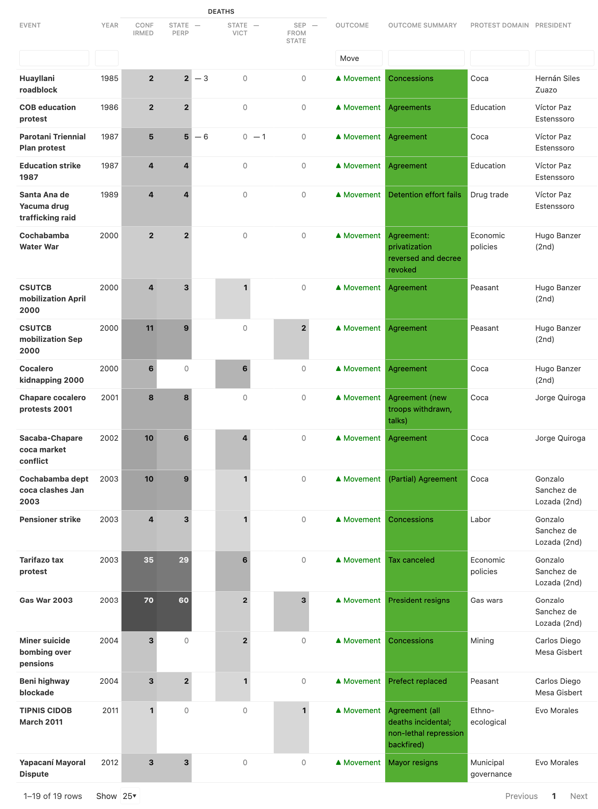
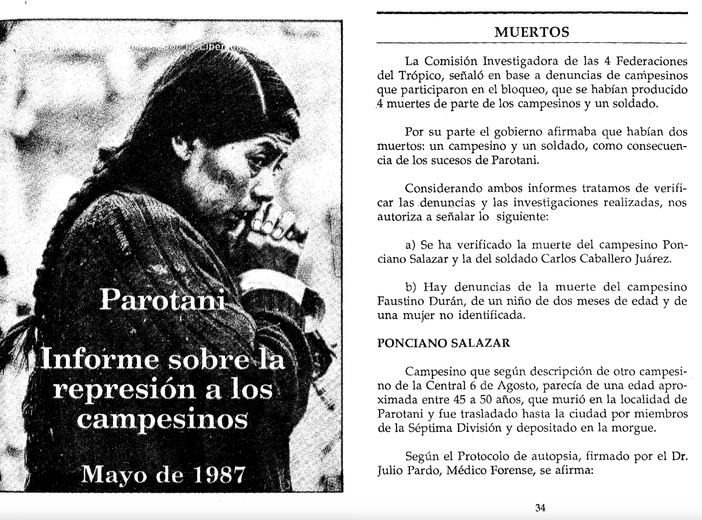

# Opening

In 2010, at the start of my graduate fieldwork on Bolivian movement practices, I (Carwil Bjork-James) sat down with Felix Ticona in his workplace, the offices of the CSUTCB peasant confederation. Within minutes, he had upended my sense of time, for when I asked about the history of the organization, he began not with its 1979 founding or the participation of peasants in the 1952 Revolution, but with five hundred years of anticolonial struggle. And this historical process, he said, “has cost us blood, has cost us indigenous peoples mourning for our brothers, who have struggled, permanently, for democracy. … This has cost blood, it has not been free, it hasn’t been a gift from anyone.”

> "El proceso histórico ha sido muy… ha costado sangre, ha costado luto a los pueblos indígenas, a nuestros hermanos, que han luchado permanente para la democracia. … Este ha costado sangre, no ha sido gratis, no ha sido regalo de nadie."

When participants in Bolivian movements say “nos ha costado sangre,” and they do so quite often across a wide variety of movements, they are situating our vulnerable human lives in an act of exchange. A price has been paid, and changes have been won at the cost of these human beings, once comrades and now venerated martyrs as much as tragic victims. Former President Evo Morales also spoke in these terms in his 2006 inaugural address, linking the phrase “has cost us blood” to the achievements of universal suffrage in the 1952 National Revolution and nationalization of natural gas reseaurces in the 2003 Gas War.

In this expression, the first person plural is also important. Bolivian movement leaders often draw attention to their region, city, or sector's participation in larger collective protests. While this can take the form of showing up in large numbers, they speak with a special reverence for those who lost their lives in protest, which marks a distinct engagement, not just as actors who exerted pressure, but as a community that suffered loss in the pursuit of a common goal.

This paper considers the cultural meaning and practical import of deaths in protest for Bolivian social movements—and specifically the way that collective groups pay a price for social progress through death—by drawing on our digital archive of over 650 deaths in protest, and on scholarly sources and published interviews with movement leaders and participants.

FIrst, we highlight a variety of particular events during which government intransigence towards a protest was replaced by immediate concessions after one or several deaths. These instances are one way in which death and loss in the midst of protest can be emotionally and socially powerful, changing and even inverting prior dynamics. Second, we consider how movement participants speak of death, loss, and sacrifice, drawing attention to how lives lost are remembered as sacrifices, as a price, and as a form of collective participation in common struggle.

### Methods: Introducing Ultimate Consequences

Ultimate Consequences is a quantitative and qualitative database, unique in its depth and completeness of coverage, of all conflict deaths in Bolivia since October 1982, a period of largely elected governments and political dynamism. During the country’s 1977–82 return to democracy, 1985 general strikes, 2000–2005 antineoliberal protest wave, and its political crises in 2006–2008 and 2019–2020, mass disruptive protest proved its ability to remake national politics. Our dataset records information such as individuals’ relation to a specific social movement, protest campaign, cause of death, responsible parties, and location. The database enables visualization and comparative analysis across twelve presidential administrations, four episodes where protesters successfully sought the end of a presidential term, and at least 632 deaths across 219 events.

Much of our recent work involves creating accessible ways for researchers and the public to access this information. We hold to project-wide commitments to making information available bilingually, and to present the data in ways that allow users to see the individuals within patterns of violence.

In addition to these database entries, we have also created brief narrative descriptions of the events involved and/or quote such descriptions directly from sources of reporting. Our iterative research strategy repeatedly seeks and integrates information from human rights reports, scholarly accounts, the Bolivian news media, and a range of other sources. We are currently building a testimonial archive of first-person narratives of these events to document their place in movement history and the impact individual losses entailed.

In a recently published article [@bjork-jamesWhenDoesLethal2024], we surveyed all 48 events from 1982 to 2021 with three or more deaths. Out of 28 cases of deadly state repression, movements won their demands in 13 cases, achieved partial success in one, and failed in ten. In those 14 successful cases alone, security forces killed at least 136 people in failed bids to quash protests. Many smaller events, with one or two deaths also fit this pattern.

{width="6in"}

### The price of victory

In a number of cases, deadly government repression was almost immediately followed by significant concessions. Essentially nothing can explain these turnarounds except the social reactions to the deaths caused by security forces. This can happen in the smallest cases, such as the 2003 Santa Rosa del Sara protests, where the police and the army attempted to repress demands for local infrastructure improvements. The very next day, the regional government agreed to residents' demands and to name the highway they would build in honor of slain protester Luis Zelaya Márquez.

We can see similar reversals in the San Julián peasant strike in 1984 (repressed with machine guns by local landowners), the 1985 road blockade at Huayllani, the April 2000 national peasant mobilization, the 2003 pensioner strike, and a 2014 mayoral recall protest in Yapacaní, not to mention the 2003 Gas War, in which 71 people were killed, before President Gonzalo Sánchez de Lozada was compelled to step down.

But we want to highlight one particular case today.

In 1987, the government faced down coca grower protests against eradication of their crops and issued a public ultimatum for protesters to end their blockades by May 27. Early on the morning of May 28, soldiers attacked the blockade at Parotani, first beating participants then firing live ammunition and tear gas. At least two cocaleros were killed, along with an unidentified female protester and two-month-old child, who was beaten with his mother. A soldier died of an accidental self-inflicted gunshot wound.

{width="6.5in"}

Two days later, the government began negotiations with coca grower leaders. Within a week, the government conceded that coca eradication should not be conducted violently, that its scale should be negotiated with coca growers’ unions, and that farmers should receive compensation for their destroyed crops. (A much vexed Reagan administration would push back with demands of its own over the following year.) These five deaths presaged a much larger trail of loss among coca growers, and especially those in the Chapare region. Ultimately, the coca conflict would consume the lives of 98 civilians, and (beginning a decade later) 35 members of the security forces.

As with this single event, this larger pattern of lives lost would be remembered as a collective price for social change. In this quote, Celima Torrico narrates [@garciayapurNoSomosMAS2015] this loss from the vantage point of women, who “were tear-gassed with their babies, who lost their husbands, who ended up wounded — Caramba, what a struggle!” But “in the final accounting,” she argues, they consolidated a political party and won social equality. “Because \[now\] we are equal, whether we come from the countryside or the city, we are equal, we are human beings … It has cost a lot … it has cost lives, it has cost blood, above all to bring about a Plurinational State.”

> “Compañeras que han entrado a la cárcel, que han sido gasificadas con sus wawas \[*bebés*\], que han perdido a sus maridos, que se han quedado heridas, **¡caramba, qué lucha!** A veces, parece que no había nada para comer, pero igual, se aguantaba la lucha. Nuestros compañeros del Trópico, hombres y mujeres, en diferentes bloqueos, en diferentes organizaciones, cómo se ha sufrido realmente. “Pero, al final de cuentas, se ha consolidado la organización sindical, el Instrumento Político por la Soberanía de los Pueblos. “Con todo esto, ya pensando lo que se quiere es la igualdad porque somos iguales, seamos del campo, de la ciudad, somos iguales, somos humanos. … Ha costado bastante llegar al proceso de cambio, **ha costado vidas**, **ha costado sangre**, sobre todo para llegar a un Estado Plurinacional.”

### Sacrificed lives as participation

This claim of collective participation of a group, movement, or region can have important political value, especially within the broad grassroots left coalition that brought the MAS to power in the 2005 elections.

> “Ya en la época critica del 2000 al 2003 … uno de los primeros comités cívicos que ha apoyado ese paro indefinido ha sido precisamente del Potosí en 2003. Así mismo, **hemos estado presentes entre las víctimas como Potosinos** de ese entonces, de esos gobiernos. Cuando en Sucre se pretendía asumir, o pretendía el presidente de la cámara de senadores o diputados a asumir la presidencia, han habido cooperativistas Potosinos que han ido a Sucre, y lamentablemente uno ha fallecido en estos enfrentamientos con la policía. Entonces, así Potosí ha estado apoyando, ha estado ayudando a este proceso. Y va a seguir. [@condori2010]

Here we see a quote from Potosí Civic Committee leader Celestino Condori in 2010. Condori’s organization had recently led a 19-day general strike and department-wide blockade campaign demanding greater investment in the impoverished region. Condori notes the region’s early and enthusiastic participation in protests, and then said, “As well, we were also present as Potosinos among the victims of those times, and from those governments.” He recalls the moment when a right-wing senate president nearly came to power, but was blockaded by protester. “It had been the Potosino mining cooperative members who went to Sucre, and lamentably one of them died in those confrontations with police. So, in that way Potosí was supporting, was helping this process. And it will keep doing so.”

### Changing meanings

It was in the same vein that CONAMAQ leaders remembered the loss of Facundo Barcaya. Barcaya was killed in February 2002 when security forces opened fire, reportedly with machine guns, on protests in Challapata that were part of a national protest wave demanding, among other things, the reversal of Evo Morales’ expulsion from the National Congress. CONAMAQ’s leader Elías Quellca praised Barcaya in 2009 [@ConamaqRatificaApoyo2009], saying we remember him as a true Apu Mallku, the highest traditional leadership position in the organization, and recognized his life as given to ensure that power “will not be in the hands of the necktied doctors” who have long ruled the country, but now “our own effective presence as native peoples of this land.”

> “En esa patriótica jornada, fueron victimados los compañeros Facundo Barcaya y Eusebia Cisneros, a quienes **ahora los recordamos como verdaderos Apu Mallkus \[**\_líderes tradicionales\_\], de nuestras naciones originarias.” El poder “ya no estará en manos de los doctores encorbatados de siempre, porque tendremos la presencia efectiva nuestra, de los originarios de esta tierra; será un Congreso que acoja a todas las clases sociales de nuestro país, y resuelva sus problemas con equidad.”

But as relations soured with the MAS government, a bitterness crept into the memories within CONAMAQ. Its 2011 protests were rebuffed and the organization was divided into pro- and anti-government factions in 2012. Here, outspoken independent leader Juana Calle remembers Barcaya’s death in a different frame: “Since Evo Morales was our brother, was an Indian … CONAMAQ rose up and blockaded, its Jach’a Carangas suyu mobilized in Challapata, where the police intervened, and we had a death. In that way CONAMAQ supported Evo Morales, but we didn’t then know that the objective was to destroy us” [@bautistaduranCaminarDosMujeres2016].

> “Como Evo Morales era nuestro hermano, era un indio; por eso también, luego de la asamblea constituyente, conamaq se ha levantado, ha bloqueado, el suyuJach’a Carangas se ha movilizado en Challapata nos han intervenido la policía, hemos tenido un muerto, ha sido Facundo Barcaya, de esa forma conamaq ha apoyado a Evo Morales, *pero no sabíamos que el objetivo era destruirnos*. … “Desde ahí nos hemos debilitado, el mas nos ha perforado, el conamaq estaba fortalecido, un suyu era toda la base, no como ahora. … Desde ese momento nos han empezado a cortar los proyectos, totalmente se ha cortado, ya no había financiamiento para hacer reuniones, ni talleres, nos han cortado desde el gobierno.”

### Conclusions

We’ve used this talk to put some examples on the table, to show how deaths in protest are wrapped in the language of blood, full of meaning and symbolism, how this blood is understood to have collective ownership in communities and organizations, and how the shedding of that blood constitutes a form of political participation in shared nationwide struggles. Like other symbolic gifts, this exchange of blood founds and unites communities, it undergirds relationships, and mandates moral bonds of reciprocity. As alliances solidify, victories are won, and promises are kept, the memory of the founding gift of someone’s life deepens and acquires greater meaning. Yet when alliances break and promises are betrayed, the meanings of this blood change, and the moral force of the alliance is spoken of, not as a form of unity, but as an emotionally powerful critique.

We hope that this talk illustrates the power of combining systematic data collection with qualitative research and look forward to sharing our data with other researchers and the public in the years to come.

The project is online at ultimateconsequences.github.io. Our primary work of 2025 is bringing the cited narrative accounts online, along with some of the testimonies and primary sources.

The Ultimate Consequences database was developed with support from Vanderbilt University and a Mellon Digital Humanities Faculty Fellowship, and is currently supported by a National Science Foundation grant (Award #2116778) and a Scaling Success grant from Vanderbilt. Chelsey Dyer and Nathan Frisch have been esteemed members of the research team.
